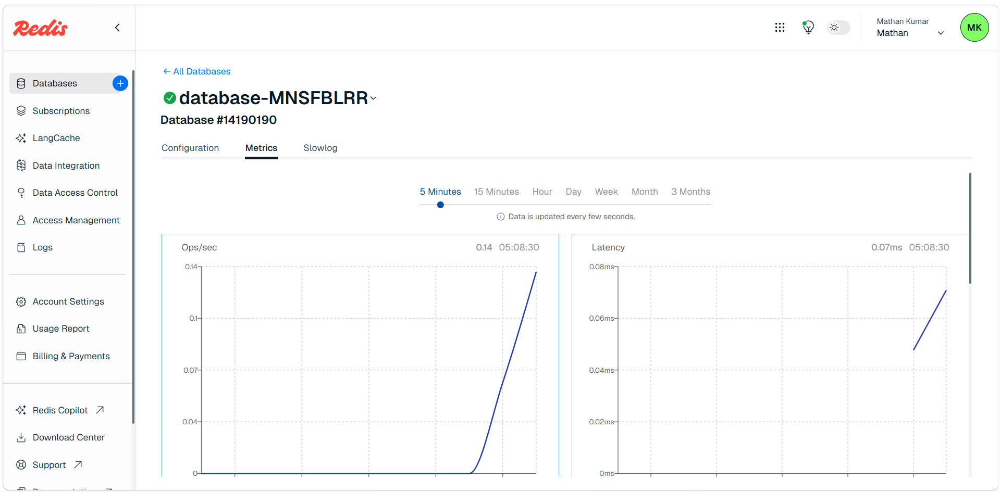
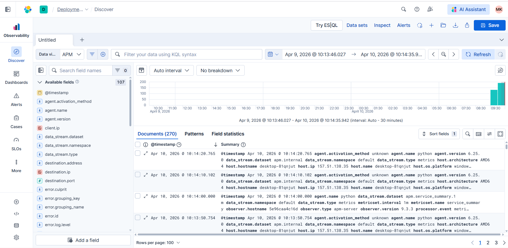

# Smart Storage Locker Management System

A comprehensive backend service for managing smart storage lockers with user reservations, Redis caching, and centralized logging with Kibana visualization.

## 🚀 Features

### Core Features
- **User Management**: Registration, login with JWT authentication, role-based access control
- **Locker Management**: Admin can create, update, and deactivate lockers
- **Reservation System**: Users can reserve and release lockers with conflict prevention
- **Redis Caching**: Cached available lockers for faster API response times
- **Centralized Logging**: Application logging with Logstash and Kibana integration for log aggregation and visualization
- **Comprehensive Monitoring**: Real-time log transfer and analytics dashboard

### Role-Based Access
- **Admin**: Create/manage lockers, view all reservations, manage users
- **User**: View available lockers, reserve lockers, release lockers, view own reservations

## 📋 Technology Stack

- **Backend Framework**: Django 5.x
- **Database**: PostgreSQL
- **Cache Layer**: Redis
- **Authentication**: JWT (JSON Web Tokens)
- **API**: Django REST Framework
- **Logging**: Python logging with Kibana/Elasticsearch integration support

## 🛠️ Installation & Setup

### Prerequisites
- Python 3.8+
- PostgreSQL
- Redis
- pip (Python package manager)

### 1. Clone the Repository
```bash
cd locker_system
```

### 2. Install Dependencies
```bash
pip install django djangorestframework djangorestframework-simplejwt django-cors-headers django-redis psycopg2-binary python-json-logger
```

### 3. Configure Database
Update `locker_system/settings.py` with your PostgreSQL credentials:
```python
DATABASES = {
    'default': {
        'ENGINE': 'django.db.backends.postgresql',
        'NAME': 'your_db_name',
        'USER': 'your_db_user',
        'PASSWORD': 'your_password',
        'HOST': 'localhost',
        'PORT': '5432',
    }
}
```

### 4. Configure Redis
Ensure Redis is running on your system:
```bash
# Windows (if using Redis for Windows)
redis-server

# Linux/Mac
sudo service redis-server start
```

### 5. Run Migrations
```bash
python manage.py makemigrations
python manage.py migrate
```

### 6. Create Superuser (Admin)
```bash
python manage.py createsuperuser
```

### 7. Run the Development Server
```bash
python manage.py runserver
```

The application will be available at: `http://localhost:8000`

## 📡 API Endpoints

### Authentication & User Management

| Method | Endpoint | Description | Access |
|--------|----------|-------------|--------|
| POST | `/api/auth/register/` | Register new user | Public |
| POST | `/api/auth/login/` | Login and get JWT token | Public |
| POST | `/api/auth/refresh/` | Refresh JWT token | Public |
| GET | `/api/auth/profile/` | Get current user profile | Authenticated |

### Locker Management

| Method | Endpoint | Description | Access |
|--------|----------|-------------|--------|
| GET | `/api/lockers/` | List all lockers | Authenticated |
| POST | `/api/lockers/` | Create new locker | Admin |
| GET | `/api/lockers/<id>/` | Get locker details | Authenticated |
| PUT | `/api/lockers/<id>/` | Update locker | Admin |
| DELETE | `/api/lockers/<id>/` | Deactivate locker | Admin |
| GET | `/api/lockers/available/` | List available lockers (Cached) | Authenticated |

### Reservation Management

| Method | Endpoint | Description | Access |
|--------|----------|-------------|--------|
| GET | `/api/reservations/` | List reservations | Authenticated |
| POST | `/api/reservations/` | Create reservation | Authenticated |
| GET | `/api/reservations/<id>/` | Get reservation details | Owner/Admin |
| PUT | `/api/reservations/<id>/release/` | Release locker | Owner/Admin |

## 🔐 Authentication

All API endpoints (except login/register) require JWT authentication.

### Getting a Token
```bash
curl -X POST http://localhost:8000/api/auth/login/ \
  -H "Content-Type: application/json" \
  -d '{"username": "your_username", "password": "your_password"}'
```

Response:
```json
{
  "access": "eyJ0eXAiOiJKV1QiLCJhbGciOiJIUzI1NiJ9...",
  "refresh": "eyJ0eXAiOiJKV1QiLCJhbGciOiJIUzI1NiJ9...",
  "user": {
    "id": 1,
    "username": "admin",
    "email": "admin@example.com",
    "role": "admin",
    "name": "Admin User"
  }
}
```

### Using the Token
Include the token in the Authorization header:
```bash
curl -X GET http://localhost:8000/api/lockers/ \
  -H "Authorization: Bearer YOUR_ACCESS_TOKEN"
```

## 📊 API Request Examples

### Register User
```bash
curl -X POST http://localhost:8000/api/auth/register/ \
  -H "Content-Type: application/json" \
  -d '{
    "username": "john_doe",
    "email": "john@example.com",
    "name": "John Doe",
    "password": "securepass123"
  }'
```

### Create Locker (Admin)
```bash
curl -X POST http://localhost:8000/api/lockers/ \
  -H "Content-Type: application/json" \
  -H "Authorization: Bearer YOUR_TOKEN" \
  -d '{
    "locker_number": "A101",
    "location": "Building A - Floor 1",
    "size": "medium",
    "status": "available"
  }'
```

### Reserve a Locker
```bash
curl -X POST http://localhost:8000/api/reservations/ \
  -H "Content-Type: application/json" \
  -H "Authorization: Bearer YOUR_TOKEN" \
  -d '{"locker_id": 1}'
```

### Release a Locker
```bash
curl -X PUT http://localhost:8000/api/reservations/1/release/ \
  -H "Authorization: Bearer YOUR_TOKEN"
```

## 🗄️ Database Models

### User Model
- `id`: Auto-incrementing primary key
- `username`: Unique username
- `email`: User email address
- `name`: Full name
- `role`: admin/user
- `created_at`: Timestamp
- `updated_at`: Timestamp

### Locker Model
- `id`: Auto-incrementing primary key
- `locker_number`: Unique locker identifier
- `location`: Locker location
- `status`: available/occupied/maintenance/deactivated
- `size`: small/medium/large
- `created_at`: Timestamp
- `updated_at`: Timestamp

### Reservation Model
- `id`: Auto-incrementing primary key
- `user`: Foreign key to User
- `locker`: Foreign key to Locker
- `status`: active/completed/cancelled
- `reserved_at`: Reservation timestamp
- `released_at`: Release timestamp
- `created_at`: Timestamp
- `updated_at`: Timestamp

## ⚡ Redis Caching Implementation

The system uses Redis to cache available lockers for improved performance:

- **Cache Key**: `available_lockers`
- **TTL**: 60 seconds
- **Strategy**: Cache-aside pattern
  - Check cache first
  - If miss, query database and store in cache
  - Cache expires naturally on reservation/release

### Cache Invalidation
Cache is automatically invalidated when:
- A new reservation is created
- A locker is released
- Cache TTL expires (60 seconds)

### Redis Cache Visualization



*Redis caching layer implementation showing cache hit/miss patterns and performance optimization*

### Configuration
```python
CACHES = {
    'default': {
        'BACKEND': 'django_redis.cache.RedisCache',
        'LOCATION': 'redis://localhost:6379/0',
        'OPTIONS': {
            'CLIENT_CLASS': 'django_redis.client.DefaultClient',
        },
        'TIMEOUT': 60,
    }
}
```

## 📝 Logging & Kibana Integration

### Log Files
- `logs/app.log`: All application logs (INFO level and above)
- `logs/error.log`: Error logs only

### Logged Events
- User registration attempts
- Login attempts (successful and failed)
- Locker creation and updates
- Reservation creation and release
- Cache hits/misses
- Errors and exceptions

### Kibana Log Transfer & Visualization



*Kibana dashboard showing centralized log aggregation, real-time monitoring, and analytics*

### Log Transfer Architecture

The system implements a complete log transfer pipeline:

1. **Application Logging**: Django generates structured JSON logs
2. **Log Collection**: Filebeat/Logstash collects logs from log files
3. **Log Processing**: Logstash parses and enriches log data
4. **Storage**: Elasticsearch stores and indexes logs
5. **Visualization**: Kibana provides dashboards and analytics

### Configuration

**Django Logging Settings:**
```python
LOGGING = {
    'version': 1,
    'disable_existing_loggers': False,
    'formatters': {
        'json': {
            '()': 'pythonjsonlogger.jsonlogger.JsonFormatter',
            'fmt': '%(levelname) %(name) %(asctime) %(module) %(message)',
        },
    },
    'handlers': {
        'file': {
            'level': 'INFO',
            'class': 'logging.FileHandler',
            'filename': BASE_DIR / 'logs' / 'app.log',
            'formatter': 'json',
        },
    },
}
```

**Logstash Configuration:**
```ruby
input {
  file {
    path => "/path/to/locker_system/logs/*.log"
    start_position => "beginning"
    codec => "json"
  }
}

filter {
  date {
    match => [ "asctime", "ISO8601" ]
  }
}

output {
  elasticsearch {
    hosts => ["http://localhost:9200"]
    index => "locker-system-logs-%{+YYYY.MM.dd}"
  }
}
```

### Benefits
- ✅ Centralized log management
- ✅ Real-time log monitoring
- ✅ Advanced search and filtering
- ✅ Custom dashboards and visualizations
- ✅ Alerting on critical errors
- ✅ Performance analytics
- ✅ Audit trail compliance

## 🎨 Web UI

Access the web interface at: `http://localhost:8000`

### Features
- User registration and login
- View available lockers (real-time)
- Reserve lockers with one click
- View and manage reservations
- Release lockers
- Admin panel for locker management
- Dashboard statistics
- Responsive design for mobile devices

## 🧪 Testing the System

### 1. Create an Admin User
```bash
python manage.py createsuperuser
```

### 2. Login as Admin
Use the UI or API to login with admin credentials

### 3. Create Lockers
Use the Admin Panel in the UI or the API to create lockers

### 4. Create a Regular User
Register a new user through the UI or API

### 5. Test Reservation Flow
- Login as regular user
- View available lockers
- Reserve a locker
- View your reservation
- Release the locker

## 🔒 Security Features

- JWT-based authentication
- Role-based access control (RBAC)
- Password hashing (Django's built-in)
- SQL injection prevention (Django ORM)
- XSS protection
- CSRF protection
- Database transactions for critical operations
- Row-level locking to prevent race conditions

## 📁 Project Structure

```
locker_system/
├── accounts/               # User authentication app
│   ├── models.py          # Custom User model
│   ├── serializers.py     # Auth serializers
│   ├── views.py           # Auth views
│   ├── permissions.py     # Custom permissions
│   └── urls.py            # Auth URLs
├── lockers/               # Locker management app
│   ├── models.py          # Locker model
│   ├── serializers.py     # Locker serializers
│   ├── views.py           # Locker views with caching
│   └── urls.py            # Locker URLs
├── reservations/          # Reservation management app
│   ├── models.py          # Reservation model
│   ├── serializers.py     # Reservation serializers
│   ├── views.py           # Reservation views
│   └── urls.py            # Reservation URLs
├── locker_system/         # Project settings
│   ├── settings.py        # Django settings
│   └── urls.py            # Main URL configuration
├── logs/                  # Application logs
│   ├── app.log
│   └── error.log
├── logstash.conf          # Logstash configuration for log transfer
├── manage.py
├── API_REFERENCE.md       # Complete API documentation
└── README.md
```

## 🚦 Status Codes

- `200 OK`: Success
- `201 Created`: Resource created
- `400 Bad Request`: Invalid input
- `401 Unauthorized`: Missing or invalid token
- `403 Forbidden`: Insufficient permissions
- `404 Not Found`: Resource not found
- `500 Internal Server Error`: Server error

## 🐛 Troubleshooting

### Redis Connection Error
Ensure Redis is running:
```bash
redis-cli ping
# Should return: PONG
```

### Database Connection Error
Check PostgreSQL credentials in `settings.py` and ensure PostgreSQL is running.

### Migration Issues
```bash
python manage.py migrate --run-syncdb
```

## 📝 License

This project is created as a backend assignment demonstration.

## 👨‍💻 Developer

Smart Locker Management System
Built with Django REST Framework

---

For questions or support, please refer to the API documentation above or check the log files in the `logs/` directory.
